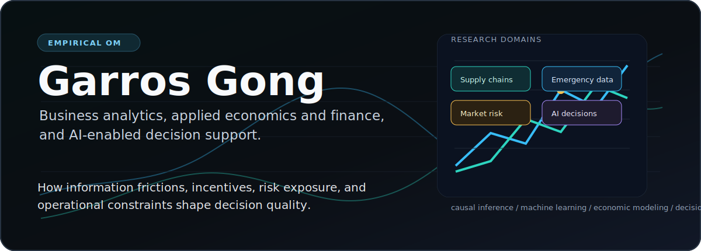
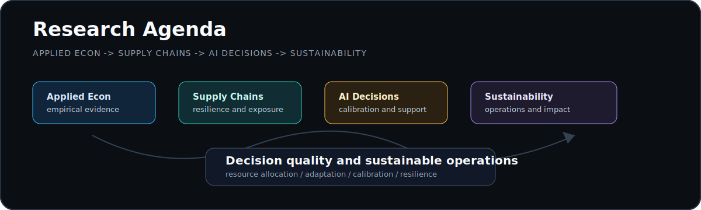

  

### About

I am an empirical operations management researcher working at the intersection of applied economics, supply chains, AI-enabled decision support, and sustainability. My research studies how information frictions, incentives, and operational constraints shape decision quality across data-driven business settings.

I recently completed my Ph.D. in Management Sciences at the University of Waterloo. I also bring senior finance-industry experience in pricing, profitability, investment strategy, treasury, and fixed-income research.

---

 
**Business Analytics, AI-Enabled Decision Support, Sustainable Operations Management, Supply-Chain Resilience, and Applied Economics and Finance**

 

My research agenda examines how organizations and markets adapt under uncertainty. Using economic modeling, empirical analysis, causal inference, and machine-learning tools, I study resource allocation and decision quality in settings where data, incentives, and operating constraints interact.

 

  

 

#### [Sustainable Wildfire Management Meets Social Media: How Virtual Interaction Affects Wildfire Response Costs](https://doi.org/10.1177/10591478261445692)
- **Authors**: Gong, G., Dimitrov, S., & Bartolacci, M. R.
- **Journal**: *Production and Operations Management* (2026)
- **Keywords**: empirical operations, emergency response, resource allocation, digital signals, decision-making under uncertainty

#### [Digital Strategies in Wildfire Management: Social Media Analytics and Web 3.0 Integration](https://link.springer.com/article/10.1007/s43621-024-00274-7)
- **Authors**: Gong, G., Dimitrov, S., & Bartolacci, M. R.
- **Journal**: *Discover Sustainability* (2024)
- **Keywords**: wildfire management, social media analytics, Web 3.0, digital coordination, decision support

 

#### [Digital Strategies in Wildfire Management: The Advantage of Applying Social Media Analytics and Web 3.0 Integration](https://sites.psu.edu/informstna/conference-program)
- **Presented at**: 2024 INFORMS Telecommunications and Network Analytics Conference, Dallas, TX
- **Keywords**: digital operations, disaster response, information systems, predictive analytics

 

#### Benchmarking Supply Chain Resilience: An Exposure-Conditioned Decision Framework
- **Keywords**: supply-chain resilience, business analytics, decision support, network exposure, operating risk

#### Mechanism Uncertainty in Firm Adaptation to Supply-Chain Shocks: A Causal-Atlas Approach
- **Keywords**: firm adaptation, causal inference, supply-chain shocks, empirical operations, mechanism evaluation

#### [When Text Helps: AI Text Signals for Calibration-Sensitive Tail-Risk Decisions in Prediction Markets](https://papers.ssrn.com/abstract=7005158)
- **Keywords**: AI-enabled decision support, text analytics, financial markets, calibration, risk analytics

#### Trade-Policy Exposure and Managerial Adjustment Margins: Regime-Dependent Evidence from Corporate Tax-Base Outcomes
- **Keywords**: applied economics, trade policy, firm adjustment, tax-base outcomes, managerial decision-making

 

As a side interest, I build basketball analytics projects. My [NBA Enhanced Defensive Index (EDI)](https://github.com/garroshub/NBA-Enhanced-Defensive-Index) and [NCAA Basketball Defensive Fingerprint Scout](https://github.com/garroshub/college-basketball-defensive-fingerprint-scout) uses public NBA and NCAA data to evaluate defensive impact across multiple dimensions.
