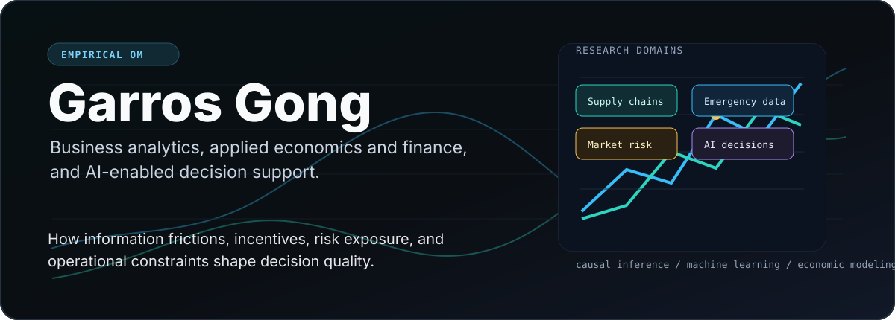
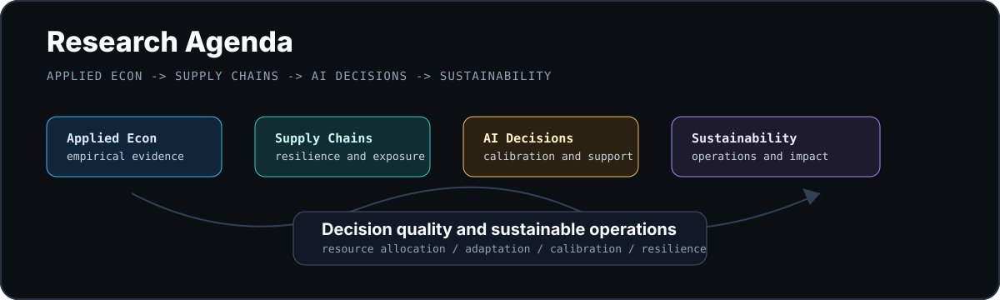

  

### About

I am an empirical management science researcher working across operations management, business analytics, applied economics and finance, and AI-enabled decision support. My research examines how information, uncertainty, incentives, and operational constraints affect business decisions.

I earned my Ph.D. in Management Sciences (Operations Research) from the University of Waterloo in 2026. I also hold an M.Sc. from Ivey Business School and bring senior finance-industry experience in pricing, profitability, investment strategy, treasury, analytics, and applied AI.

---

**Business Analytics, AI-Enabled Decision Support, Sustainable Operations Management, Supply-Chain Resilience, and Applied Economics and Finance**

 

My research agenda examines how organizations and markets adapt under uncertainty. I use econometrics, causal inference, network analysis, machine learning, and optimization to study when new information improves decisions under realistic operational constraints.

 

  

 

#### [Sustainable Wildfire Management Meets Social Media: How Virtual Interaction Affects Wildfire Response Costs](https://doi.org/10.1177/10591478261445692)
- **Authors**: Gong, G., Dimitrov, S., & Bartolacci, M. R.
- **Journal**: *Production and Operations Management* (2026)
- **Keywords**: empirical operations, emergency response, resource allocation, social-media signals, operational efficiency

#### [Trade-Policy Exposure and Managerial Adjustment Margins: Regime-Dependent Evidence From Corporate Tax-Base Outcomes](https://doi.org/10.1002/mde.70150)
- **Authors**: Gong, G., & Dimitrov, S.
- **Journal**: *Managerial and Decision Economics* (2026)
- **Keywords**: applied economics, trade policy, managerial adjustment, corporate tax, policy regimes

#### [Digital Strategies in Wildfire Management: Social Media Analytics and Web 3.0 Integration](https://link.springer.com/article/10.1007/s43621-024-00274-7)
- **Authors**: Gong, G., Dimitrov, S., & Bartolacci, M. R.
- **Journal**: *Discover Sustainability* (2024)
- **Keywords**: wildfire management, social media analytics, Web 3.0, digital coordination, decision support

 

#### [Digital Strategies in Wildfire Management: The Advantage of Applying Social Media Analytics and Web 3.0 Integration](https://sites.psu.edu/informstna/conference-program)
- **Presented at**: 2024 INFORMS Telecommunications and Network Analytics Conference, Dallas, TX
- **Keywords**: digital operations, disaster response, information systems, predictive analytics

 

#### Benchmarking Supply Chain Resilience: An Exposure-Conditioned Decision-Support Framework
- **Status**: Major Revision, *Omega*
- **Keywords**: supply-chain resilience, network exposure, risk benchmarking, business analytics, decision support

#### The Task-Specific Predictive and Decision Value of Customer Reconfiguration
- **Status**: Under Peer Review, *Management Science*
- **Authorship**: Solo-authored
- **Keywords**: customer networks, supply-chain adaptation, predictive value, surveillance allocation, decision analytics

#### [When Text Helps: AI Text Signals for Calibration-Sensitive Tail-Risk Decisions in Prediction Markets](https://papers.ssrn.com/abstract=7005158)
- **Status**: Major Revision, *Decision Sciences Journal*
- **Keywords**: AI-enabled decision support, text analytics, prediction markets, probability calibration, risk decisions

#### Risk-Responsive Public Resource Allocation: Evidence and Decision Design in U.S. Wildfire Management
- **Status**: Under Peer Review, *Manufacturing & Service Operations Management*
- **Keywords**: resource allocation, sustainable operations, wildfire management, risk forecasting, constrained optimization

#### Integration Without Synchronization: Stage–Channel Fit in Firms' Climate Strategies Under Political Rollback Signals
- **Status**: Under Peer Review, *Strategic Management Journal*
- **Keywords**: corporate climate strategy, nonmarket strategy, political uncertainty, firm adaptation, sustainability

#### A Multi-Margin View of Financial Decisions: Valuation and Trading Around the 2013 U.S. Tax Changes
- **Status**: Under Peer Review, *Journal of International Financial Management & Accounting*
- **Keywords**: financial economics, tax policy, event studies, valuation, trading behavior

 

I develop open-source tools that connect statistical models, machine learning, and AI agents with evidence-based business decisions. My projects focus on model validation, interpretability, and the conditions under which AI systems should influence or control a decision.

#### [AI Economist Skill](https://github.com/garroshub/ai-economist-skill)

An installable agent skill for macroeconomic nowcasting and monetary-policy analysis. It combines structural statistical baselines with machine-learning calibration to evaluate GDP forecasts and policy-rate signals for the United States and Canada. The workflow includes out-of-sample backtesting, data-timing controls, and interpretable model comparisons.

**Focus**: Macroeconomic forecasting, interpretable ML, statistical modeling, central-bank policy diagnostics

#### [Agent Decision Harness](https://github.com/garroshub/AgentDecisionHarness)

An open-source framework for evidence-grounded financial prediction using LLMs and specialized statistical models. It evaluates when forecasting authority should be delegated to a specialist based on historical qualification, task applicability, and conditional routing. The framework also audits prediction records for consistency between classifications, estimates, intervals, and supporting evidence.

**Focus**: Agentic AI, decision authority, financial forecasting, model governance, interpretable decision support

 

As a side interest, I build basketball analytics projects. My [NBA Enhanced Defensive Index (EDI)](https://github.com/garroshub/NBA-Enhanced-Defensive-Index) and [NCAA Basketball Defensive Fingerprint Scout](https://github.com/garroshub/college-basketball-defensive-fingerprint-scout) use public NBA and NCAA data to evaluate defensive impact across multiple dimensions.
